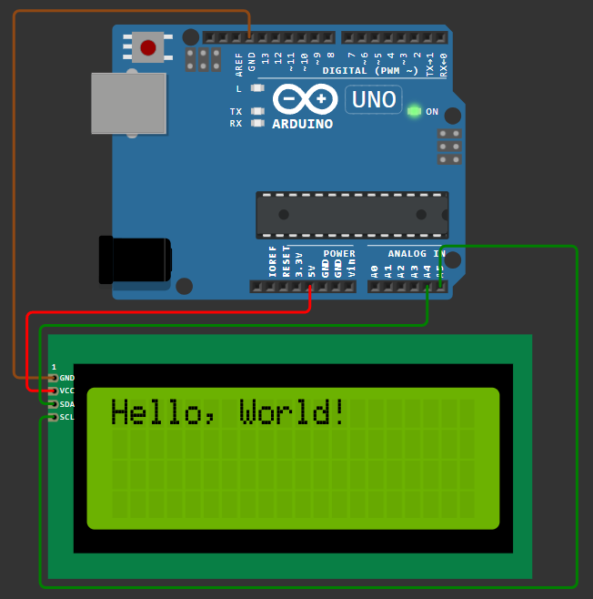
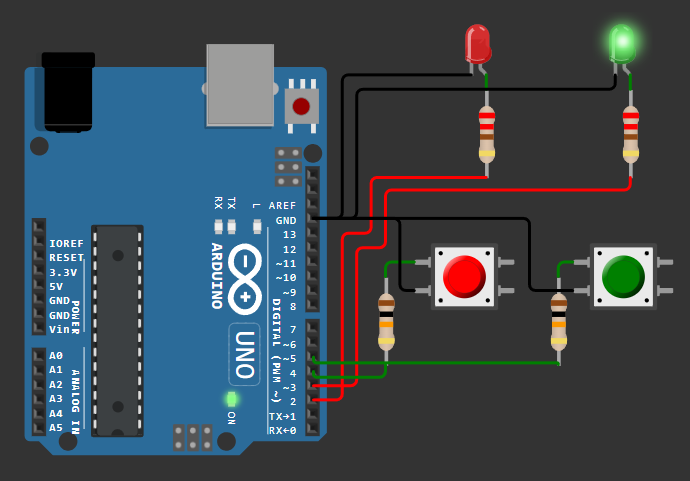
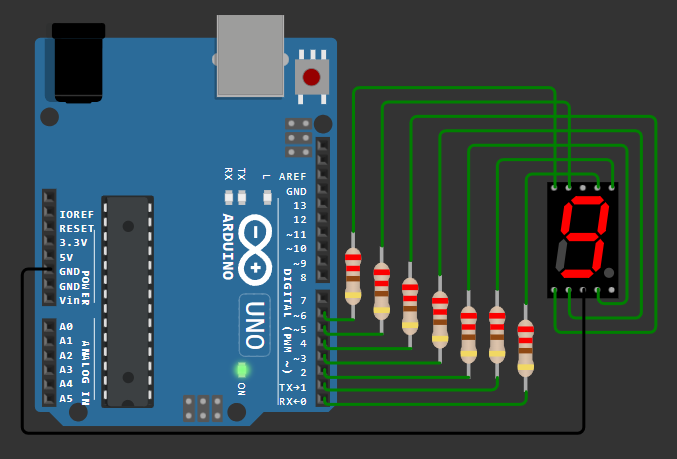
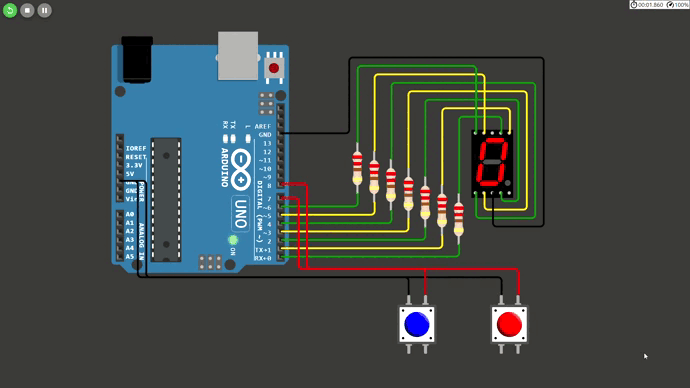

<div align="center" style="display: inline_block">
  
  
  
</div>

<br>
<div align="center">
  
<table>
<thead>
  <tr>
    <td rowspan="2"></td>
    <td>Professor: Diego Ascanio</td>
    <td>Disciplina: Lab. de Micro</td>
  </tr>
  <tr>
    <td>Aluno: <code>Celso Vinícius Sudário</code></td>
    <td>Matrícula: <code>20203003611</code></td>
  </tr>
</thead>
</table>

</div>

## Exercício 1

<div align="justify">

Simule o circuito Olá Mundo com o Arduino no Wokwi.

</div>

### Resolução

<div align="justify">

Nesta solução, é simulado um simples circuito "Olá Mundo" utilizando um Arduino conectado a um display LCD via I2C. O código incorpora a biblioteca `LiquidCrystal_I2C` para facilitar a comunicação com o LCD, mostrando como um texto pode ser facilmente exibido em um LCD com o Arduino.

</div>

```C++
#include <LiquidCrystal_I2C.h>

LiquidCrystal_I2C lcd(0x27, 16, 2);

void setup(){
  lcd.init();                      
  lcd.backlight();                 
  lcd.setCursor(0, 0);            
  lcd.print("Hello, World!");      
}

void loop(){
}
```

<p align="center">
 
</p>
<p align="center">
<em>Figura 1: Captura de tela do exercicio 1 implementado.</em>
</p>

<div align=center>
Link do projeto: https://wokwi.com/projects/394246208386606081
</div>
  
## Exercício 2

<div align="justify">

Projete um circuito com Arduino conectando a ele dois botões, um LED vermelho e um LED verde. Em seguida faça um programa em que quando um botão é pressionado o LED vermelho acende e o verde fica apagado. Quando o outro botão é pressionado os LEDs se alternam.

</div>

### Resolução

<div align="justify">

O programa define pinos para os LEDs e botões, configurando-os apropriadamente como entrada ou saída. No loop principal, ele verifica o estado dos botões: quando um botão é pressionado, o `ledRed` acende e o `ledGreen` apaga; ao pressionar o outro botão, os LEDs alternam seus estados. Isso é conseguido lendo os estados atuais dos botões, comparando-os com os estados anteriores para detectar uma transição de `LOW` para `HIGH`, e então ajustando os LEDs de acordo. Um `delay` é adicionado para estabilizar as leituras dos botões.

</div>

```C++
const int buttonPin1 = 4; 
const int buttonPin2 = 5; 
const int ledRed = 2;     
const int ledGreen = 3;   

bool lastButtonState1 = LOW;
bool lastButtonState2 = LOW;

void setup() {
  pinMode(buttonPin1, INPUT);
  pinMode(buttonPin2, INPUT);
  pinMode(ledRed, OUTPUT);
  pinMode(ledGreen, OUTPUT);
}

void loop() {
  bool currentButtonState1 = digitalRead(buttonPin1);
  bool currentButtonState2 = digitalRead(buttonPin2);

  if (currentButtonState1 == HIGH && lastButtonState1 == LOW) {
    digitalWrite(ledRed, HIGH); 
    digitalWrite(ledGreen, LOW); 
  }
  
  if (currentButtonState2 == HIGH && lastButtonState2 == LOW) {
    digitalWrite(ledRed, LOW);
    digitalWrite(ledGreen, HIGH); 
  }

  lastButtonState1 = currentButtonState1;
  lastButtonState2 = currentButtonState2;

  delay(50);
}
```

<p align="center">
 
</p>
<p align="center">
<em>Figura 2: Captura de tela do exercicio 2 implementado.</em>
</p>

<div align=center>
Link do projeto: https://wokwi.com/projects/394246440396651521
</div>

## Exercício 3

<div align="justify">

Projete um circuito com o Arduino e um display de 7 segmentos, utilizando os pino digitais de 0 a 7 para os segmentos de “a” a “g”, respectivamente. Faça um programa que apresenta o número 9 neste display.

</div>

### Resolução

<div align="justify">

Neste exercício, foi criado um circuito utilizando o Arduino e um display de 7 segmentos, com os segmentos de “a” a “g” conectados aos pinos digitais de 0 a 6, respectivamente. Para programar o Arduino para exibir o número 9 no display, o código inicia definindo os pinos dos segmentos como saídas no `setup()`. A função `displayNumber9()` é então chamada para acionar os segmentos apropriados: todos, exceto o segmento "e" (pin 4), são ativados (HIGH), configurando o display para mostrar o número 9. O `loop()` é deixado vazio, pois a exibição do número 9 é estática, não necessitando de atualizações contínuas.

</div>

```C++
const int segmentPins[] = {0, 1, 2, 3, 4, 5, 6}; 

void setup() {
  for (int i = 0; i < 7; i++) {
    pinMode(segmentPins[i], OUTPUT);
  }

  displayNumber9();
}

void loop() {
  
}

void displayNumber9() {
  digitalWrite(segmentPins[0], HIGH); 
  digitalWrite(segmentPins[1], HIGH); 
  digitalWrite(segmentPins[2], HIGH); 
  digitalWrite(segmentPins[3], HIGH); 
  digitalWrite(segmentPins[4], LOW);  
  digitalWrite(segmentPins[5], HIGH); 
  digitalWrite(segmentPins[6], HIGH);
}
```

<p align="center">
 
</p>
<p align="center">
<em>Figura 3: Captura de tela do exercicio 3 implementado.</em>
</p>

<div align=center>
Link do projeto: https://wokwi.com/projects/394250545029975041
</div>

## Exercício 4

<div align="justify">

Adicione 2 botões ao circuito do exercício anterior e faça um programa onde uma contagem de 0 a 9 é apresentada no display. O número apresentado deve aumentar ou diminuir conforme os botões são pressionados, um botão aumenta e outro diminui o número apresentado no display.

</div>

### Resolução

<div align="justify">

O programa define pinos para os segmentos do display e para os botões de incremento e decremento. Uma matriz `numbers` armazena os estados necessários dos segmentos para representar os números de 0 a 9. A lógica principal, dentro do `loop()`, verifica o estado dos botões: se o botão de incremento é pressionado, o número atual aumenta, enquanto que o botão de decremento reduz o número. Caso os limites de 0 ou 9 sejam ultrapassados, a contagem é reiniciada no limite oposto. A função `updateDisplay` é chamada para atualizar o display com o número atual, acendendo ou apagando os segmentos conforme necessário.

</div>

```C++
const int segmentPins[] = {0, 1, 2, 3, 4, 5, 6};
const int btnIncrease = 7;
const int btnDecrease = 8;

const byte numbers[10][7] = {
  {1,1,1,1,1,1,0}, // 0
  {0,1,1,0,0,0,0}, // 1
  {1,1,0,1,1,0,1}, // 2
  {1,1,1,1,0,0,1}, // 3
  {0,1,1,0,0,1,1}, // 4
  {1,0,1,1,0,1,1}, // 5
  {1,0,1,1,1,1,1}, // 6
  {1,1,1,0,0,0,0}, // 7
  {1,1,1,1,1,1,1}, // 8
  {1,1,1,1,0,1,1}  // 9
};

int currentNumber = 0;

void setup() {
  for (int i = 0; i < 7; i++) {
    pinMode(segmentPins[i], OUTPUT);
  }

  pinMode(btnIncrease, INPUT_PULLUP);
  pinMode(btnDecrease, INPUT_PULLUP);

  updateDisplay(currentNumber);
}

void loop() {
  if (!digitalRead(btnIncrease)) {
    currentNumber++;
    if (currentNumber > 9) currentNumber = 0;
    updateDisplay(currentNumber);
    delay(200);
  }

  if (!digitalRead(btnDecrease)) {
    currentNumber--;
    if (currentNumber < 0) currentNumber = 9;
    updateDisplay(currentNumber);
    delay(200); 
  }
}

void updateDisplay(int number) {
  for (int segment = 0; segment < 7; segment++) {
    digitalWrite(segmentPins[segment], numbers[number][segment]);
  }
}
```

<p align="center">
 
</p>
<p align="center">
<em>Figura 4: GIF do exercicio 4 implementado.</em>
</p>

<div align=center>
Link do projeto: https://wokwi.com/projects/394250655260491777
</div>
